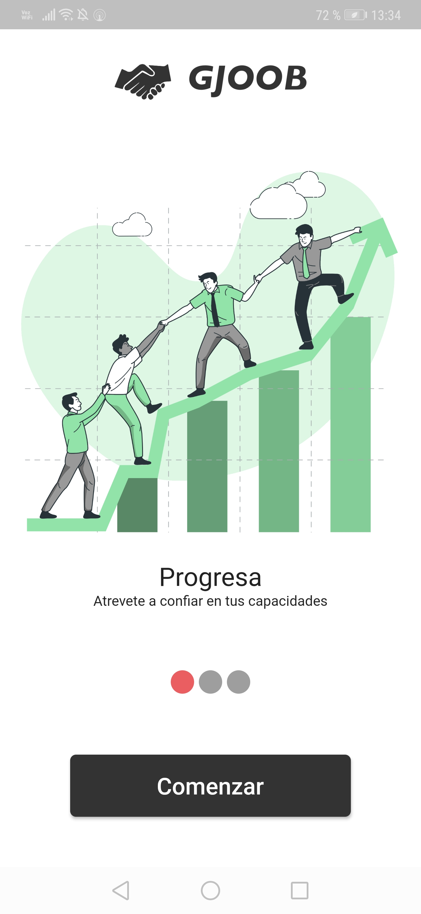
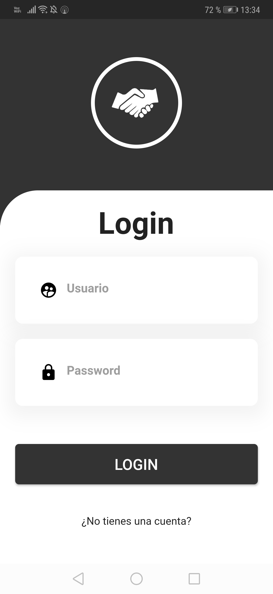
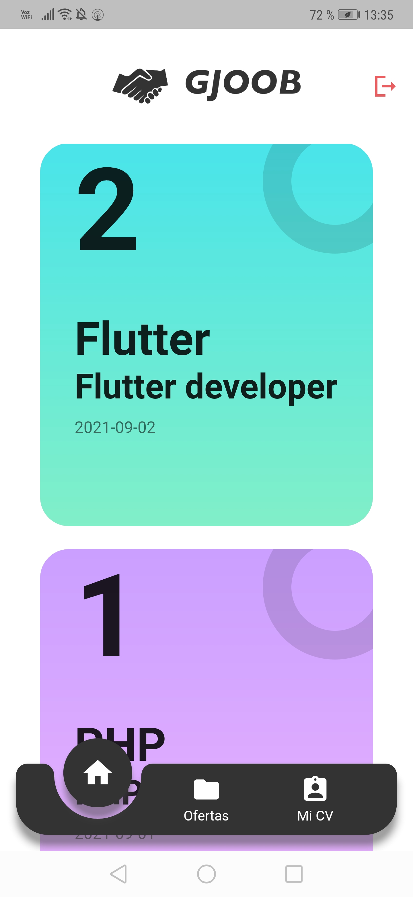
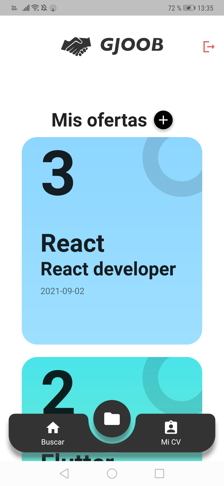
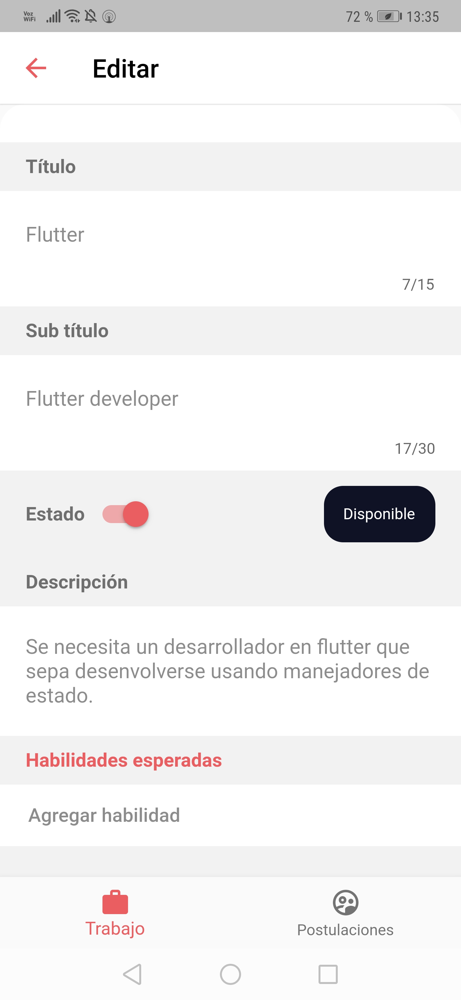
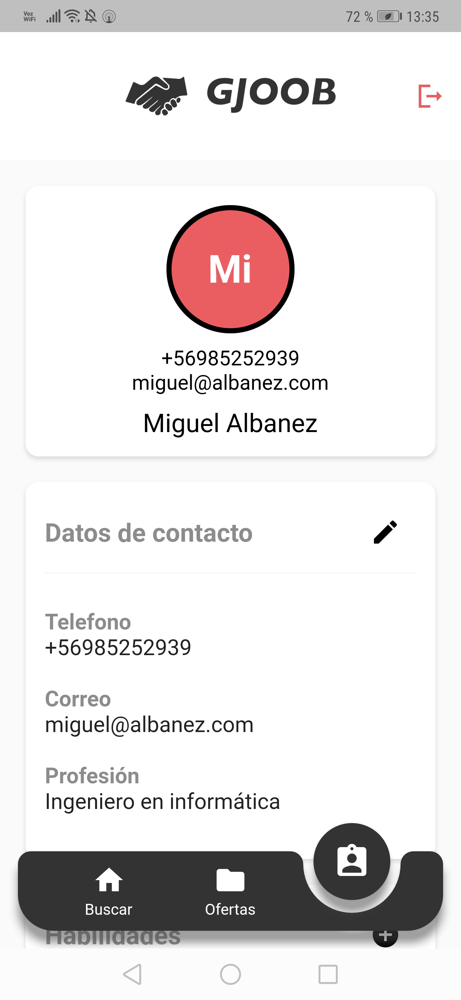
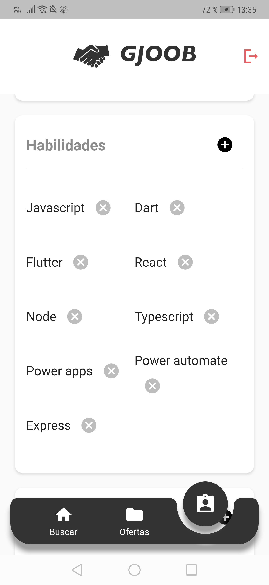
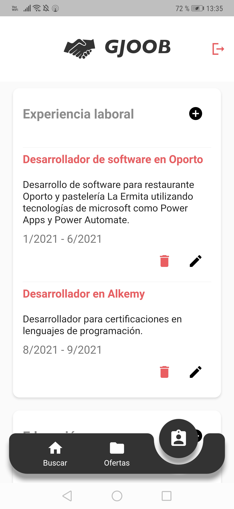
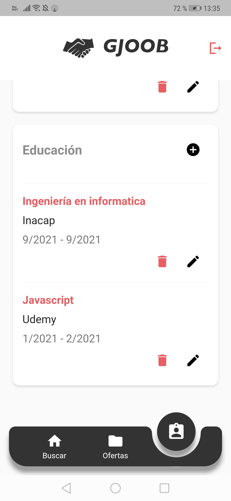
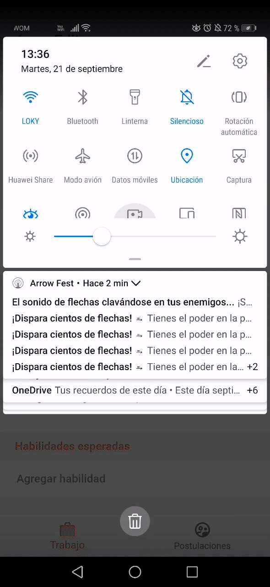

# GJoob

GJboob es una aplicacion de prueba que consiste en postular a un trabajo, llenar los requerimientos y mandar tu curriculum, y los que no son marcados, son expuestos como caacitaciones necesarias que vera tu empleador para ver si es posible capacitarte en esas herramientas o simplemente no te considera, ademas podra crear tus propias ofertas laborales y modificar tu curriculum.
La aplicacion se alimenta de una api creada en Node.js que actualmente está desplegada en Heroku.

## Instalación

Ejecutar el siguiente comando en la raiz del proyecto para instalar las dependencias
### `flutter packages get`

## Levantar la aplicacion

Seleccione un dispositivo movil y levante la aplicación

### `F5`

## Imagenes de la aplicacion 

   
   
   

   
   
   

   
   
   

  
    
    

  
  
    
    

## Video resumen

